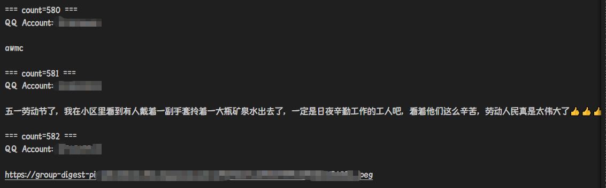

# QQ群精华消息爬虫 requests_qq_essence(25年5月可用)

* 必须使用Python3，不兼容Python2
* 基于 Requests 库与 lxml 库 进行开发必须使用pip进行安装

## Install:

```bash
> pip install requests
> pip install lxml
```

## Reveal:

群精华保存在了JH.txt中，图片保存在了img文件夹下并以群精华当前编号为名字




## Essence_better.py Usage

在51\52行，设置抓取的群精华条数（从新到旧）

在58行设置qq群号

在65行设置cookie

cookie设置教程：

打开[QQ群官网](https://qun.qq.com/#/member-manage/base-manage "哎腾讯，哎Bot杀手")，登入后进入cookie界面

 cookie 只需要 p_skey p_uin uin skey

 p_uin 和 uin QQ号前面有个o不要认成0更不要漏掉

 cookie样例: p_skey=************************; p_uin=o{qq号}; uin=o{QQ号}; skey=********

建议让程序在cmd中运行

`python essence_better.py`

## Old Usage:

以下是essence.py的使用方法（单次获取一条群精华）

1、将群号放入第30行 `<br>`
2、将抓到的 cookie 放入到第40行 cookie 中即可。

> 打开 历史精华 时抓包

`<br>`如图所示，在配置好的情况下 使用以下方式即可获得精华消息

```bash
python essence.py [条数]
```

> 为了方便调用所以直接把图片的源地址进行输出
> 只需要判断下标0-9是否为"https://"

如果精华消息是文字图片的混合模式，图文顺序会保持一致

**Nodejs**

```nodejs
const execSync = require('child_process').execSync;
out = execSync('python3 ./essence.py '+1)).toString()
```

## connect

Discord：Time#4381
**QQ: 583416178**

PR提交者qq:1747116410
